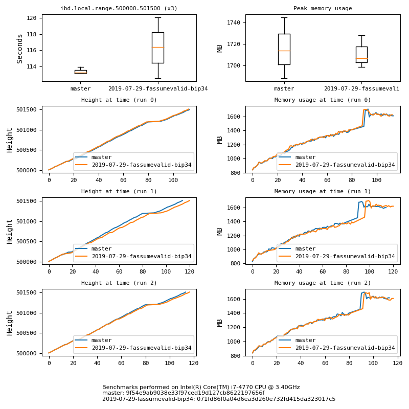

## Bitcoin Core performance monitor 📈

[bitcoinperf.com](https://bitcoinperf.com)

This repository consists of a few components

- a haphazard Python script for running high-level Bitcoin Core benchmarks,
- a [codespeed](https://github.com/chaincodelabs/codespeed) installation which
  collects and presents benchmarking results in a web interface, and
- a Grafana interface for presenting the benchmark results.



*It even uses matplotlib to generate graphs that look decent half the time.*

The benchmarks which are monitored are

- Build time (make)
- Unittest duration (make check)
- Functional test framework duration (test/functional/test_runner.py)
- Microbenchmarks (bench-bitcoin)
- IBD up to some height from a local peer or from the P2P network
- IBD of an interesting range of the chain (based on preexisting datadir)
- Reindex up to some height

The Python script (`bitcoinperf`) may be used as a standalone script
(in conjunction with the Docker configuration) to benchmark and compare
different Bitcoin commits locally - without necessarily writing to a remote
codespeed instance.

### Example local usage (no docker)

```sh
pip3 install --user .
bitcoinperf [path to YAML config file]
bitcoinperf examples/pr_compare.yml
```

See the [examples/](examples/) for sample usages.


### Example local usage (docker)

First, you may have to modify the `synced` mountpoint in `docker-compose.yml`
from `/data/bitcoin_bench` to a path on your machine that corresponds to a
Bitcoin datadir which is synced up to your desired stopatheight.

Install docker & docker-compose, then run

#
```sh
# Bring up codespeed server and a synced bitcoind instance

$ ./bin/dev up codespeed

# Modify docker-compose.yml to reference a synced datadir on your host machine.

$ sed -ie 's#/data/bitcoin_bench#/path/to/your/datadir#g' docker-compose.dev.yml

$ ./bin/dev runbench bitcoinperf examples/smoketest.yml
```

Navigate to http://localhost:8000/ to see results reported to codespeed.

### Running unittests

```sh
$ ./bin/dev up codespeed
$ ./bin/dev test
```

### Configuring Grafana

Grafana dashboards can be recreated locally by importing the JSON files
stored in `grafana_management/backups/`.

When dashboards are edited on the live environment, they should be backed up
using `grafana_management/backup_dashboard_json.sh`.

In order for the saved Grafana dashboard configurations to work, you'll need
to make sure you've installed the Postgres views contained in
`codespeed/migrations/001-result-views.sql`.
